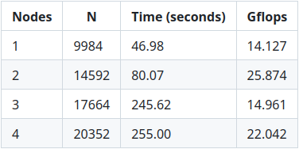

# Raspberry Pi Cluster
Weekend class project to create a 4 node cluster from raspberry pi model 4B 2GB RAM and a gigabit ethernet switch 
## Projects used 
https://github.com/pmodels/mpich 
https://github.com/xianyi/OpenBLAS 
https://www.netlib.org/benchmark/hpl/ 
Website to generate HPL.dat file: https://www.advancedclustering.com/act_kb/tune-hpl-dat-file/ 
## Benchmark 
 
## Cable management is not an afterthought 

