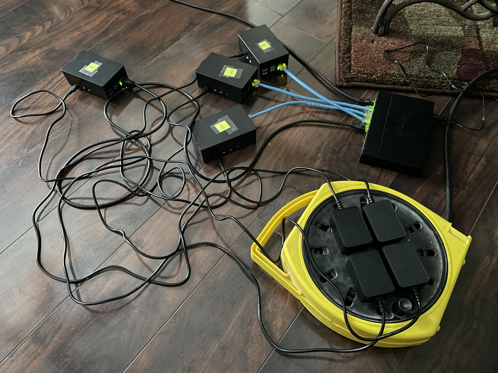

# pi-cluster
Weekend class project to create a 4 node cluster from raspberry pi model 4B 2GB RAM and a Gigabit ethernet switch 

 
Projects used: 
https://github.com/pmodels/mpich 
https://github.com/xianyi/OpenBLAS 
https://www.netlib.org/benchmark/hpl/ 
 
Website used to generate HPL.dat file: 
https://www.advancedclustering.com/act_kb/tune-hpl-dat-file/